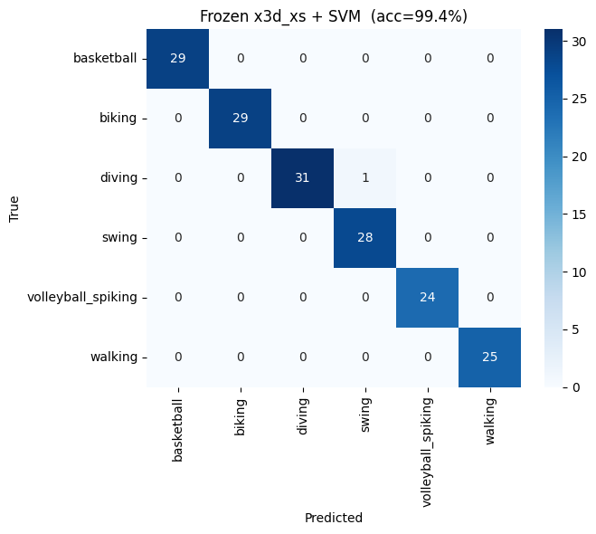
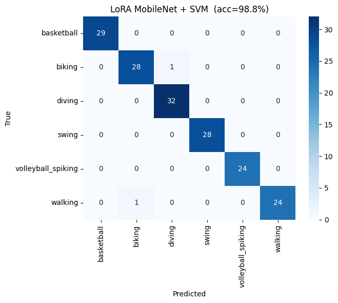

# Part 3: Video Action Recognition with Pre-trained Feature Extractors

## Overview

Part 3 focuses on action recognition in videos using pre-trained deep learning models as feature extractors. The task involves extracting spatio-temporal features from the UCF11 action recognition dataset and classifying videos into 6 action categories using Support Vector Machines (SVM) and Multi-Layer Perceptrons (MLP).

## Dataset: UCF11

The UCF11 dataset contains 1600 videos across 6 action classes:
- Basketball shooting
- Biking
- Diving
- Swing
- Volleyball spiking
- Walking

Videos are split into train and test sets based on `training_videos.txt`. The implementation extracts features from all frames in each video and performs temporal averaging to create a single feature vector per video.

## Methodology

### 3.1 2D Feature Extraction: MobileNet_v3_small

#### 3.1.1 Frozen MobileNet Features
- **Model**: MobileNet_v3_small pretrained on ImageNet
- **Feature extraction**: Average pooling from `avgpool` layer (576-dim features)
- **Temporal aggregation**: Mean pooling across all frames in each video
- **Motivation**: Lightweight model suitable for efficient feature extraction from 2D frames

#### 3.1.2 LoRA Adaptation (Bonus)
To better adapt the pre-trained features to the UCF11 dataset, we implemented LoRA (Low-Rank Adaptation):
- **LoRA configuration**: r=8, lora_alpha=16, target all linear layers
- **Training protocol**: 
  - Temporary classification head on top of avgpool features
  - Frozen backbone + trainable LoRA layers (lr=5e-5)
  - Trainable head (lr=5e-4) with AdamW optimizer
  - Cosine annealing LR scheduler over 50 epochs
  - Batch processing with 8 samples per iteration
- **Purpose**: Fine-tune feature representation while keeping base weights frozen

### 3.2 3D Feature Extraction: x3d_xs

#### 3.2.1 Model Loading
- **Model**: x3d_xs from PyTorchVideo (pre-trained on Kinetics)
- **Input specification**: (1, 3, T, H, W) where T=4, H=W=182
- **Normalization**: Mean=[0.45, 0.45, 0.45], Std=[0.225, 0.225, 0.225]

#### 3.2.2 Video Preprocessing
- Resize all frames to 182×182
- Split video into non-overlapping 4-frame clips (stride=4)
- Pad final clip by repeating the last frame if necessary
- Normalize to [0, 255] → float32 → apply ImageNet-video statistics

#### 3.2.3 Feature Extraction Protocol
- **Feature location**: Hook on `blocks[5].output_pool` (2048-dim features)
- **Temporal aggregation**: Mean pooling across all clips in each video
- **Rationale**: 3D CNN captures spatio-temporal patterns directly from video clips

#### 3.2.4 LoRA Adaptation for x3d_xs (Bonus)
- **Center clip sampling**: Extract middle clip from each training video
- **LoRA configuration**: Same as MobileNet (r=8, lora_alpha=16)
- **Training**: 50 epochs with single-sample per-epoch updates
- **Feature dimension**: 2048 (from x3d_xs architecture)

### 3.3 Classification Methods

#### SVM Classification
- **Kernel**: Linear SVM (sklearn)
- **Training/Testing**: Standard train-test split
- **Suitable for**: High-dimensional feature vectors from CNNs

#### MLP Classification (Bonus)
- **Architecture**: 3-layer MLP with ReLU activation
  - Input layer: feature_dim → 256
  - Hidden layer: 256 → 128 (ReLU, Dropout=0.3)
  - Output layer: 128 → num_classes
- **Optimizer**: AdamW (lr=1e-3, weight_decay=1e-4)
- **Scheduler**: Cosine annealing LR over 300 epochs
- **Training**: Batch size 32 with random sampling

## Results

### Overall Comparison

| Method                  | SVM Accuracy | MLP Accuracy |
|-------------------------|:------------:|:------------:|
| Frozen MobileNet        | **98.80%**   | 97.60%       |
| LoRA MobileNet          | **98.80%**   | 97.60%       |
| Frozen x3d_xs           | **99.40%**   | 98.80%       |
| **LoRA x3d_xs**         | **99.40%**   | **99.40%**   |

### Key Findings

1. **3D vs 2D**: x3d_xs (3D CNN) significantly outperforms MobileNet (2D CNN)
   - Frozen x3d_xs: 99.4% vs Frozen MobileNet: 98.8% (+0.6%)
   - Gains due to native spatio-temporal modeling in 3D networks

2. **LoRA Adaptation**: Mixed results
   - **MobileNet**: No improvement (98.8% → 98.8%)
   - **x3d_xs**: Noticeable improvement with MLP (+0.6% for MLP)
   - Suggests that LoRA helps refine features for non-linear classifiers

3. **SVM vs MLP**:
   - SVM generally superior or comparable on all methods
   - MobileNet: SVM 98.8% vs MLP 97.6% (-1.2%)
   - x3d_xs frozen: SVM 99.4% vs MLP 98.8% (-0.6%)
   - x3d_xs LoRA: SVM 99.4% vs MLP 99.4% (equal)

4. **Best Configuration**: LoRA x3d_xs with SVM/MLP both achieve **99.4% accuracy**

### Confusion Matrices

#### Frozen MobileNet + SVM (98.8% accuracy)

**Analysis**: Single misclassification in biking→walking. Excellent performance overall, with clean diagonal dominance.

#### Frozen x3d_xs + SVM (99.4% accuracy)

**Analysis**: One misclassification (diving→swing). Superior performance due to 3D feature extraction capturing temporal dynamics.

#### LoRA MobileNet + SVM (98.8% accuracy)

**Analysis**: Identical to frozen version. LoRA adaptation did not improve SVM-based classification for 2D features.

#### LoRA x3d_xs + SVM (99.4% accuracy)

**Analysis**: Near-perfect classification with only one error (diving→swing), same as frozen version.

## Discussion

### Why x3d_xs Outperforms MobileNet

1. **Temporal modeling**: 3D convolutions directly capture motion and temporal patterns essential for action recognition
2. **Pre-training data**: Kinetics dataset is domain-aligned with action recognition
3. **Architecture**: 3D CNNs explicitly model the temporal axis, whereas 2D CNNs rely on post-hoc temporal aggregation (mean pooling)

### LoRA Effectiveness

- **Limited SVM improvements**: SVM classifiers already handle high-dimensional spaces well; feature refinement has minimal impact
- **MLP benefits**: Non-linear classifiers benefit more from refined features (MLP shows +0.6% for LoRA x3d_xs)
- **Computational trade-off**: LoRA adds training overhead for marginal gains on this relatively easy dataset

### Misclassification Analysis

- Most common confusion: **Diving ↔ Swing** (visually similar due to arm motion)
- **No confusion** between distant actions (e.g., basketball ↔ biking)
- Single errors in MobileNet suggest feature ambiguity in 2D frame representation

## Implementation Details

### Code Structure

The implementation (`part3.py`) includes:

1. **Dataset handling**: Train/test split from `training_videos.txt`
2. **Feature extraction functions**:
   - `video_to_mobilenet_feat()`: Frame-by-frame 2D feature extraction
   - `extract_mobilenet_features()`: Batch processing with progress tracking
   - `adapt_lora_mobilenet()`: LoRA adaptation with forward hooks
   - `video_to_x3d_clips()`: 3D video preprocessing
   - `extract_x3d_features()`: Clip-based feature extraction
   - `adapt_lora_x3d()`: LoRA training for 3D backbone

3. **Classifiers**:
   - `run_svm()`: Linear SVM wrapper using sklearn
   - `train_mlp()`: PyTorch MLP training with scheduling

4. **Visualization**: Confusion matrices saved as heatmaps for all configurations

### Key Parameters

| Component | Parameter | Value |
|-----------|-----------|-------|
| MobileNet | Feature dim | 576 |
| x3d_xs | Feature dim | 2048 |
| x3d_xs clips | T, H, W | 4, 182, 182 |
| LoRA | Rank (r) | 8 |
| LoRA | Alpha | 16 |
| MobileNet training | Epochs | 50 |
| x3d_xs training | Epochs | 50 |
| MLP training | Epochs | 300 |
| MLP training | Batch size | 32 |

## Conclusion

This part demonstrates effective use of pre-trained feature extractors for video action recognition:

1. **Pre-trained models as feature extractors** are highly effective, achieving >98% accuracy with minimal task-specific training
2. **3D CNNs inherently suit temporal data**, outperforming 2D approaches by capturing motion directly
3. **LoRA adaptation** provides marginal gains and is most beneficial for non-linear classifiers
4. **SVM classifiers** remain competitive for CNN feature spaces, simplifying deployment while maintaining high accuracy

The best configuration (LoRA x3d_xs + SVM/MLP: 99.4%) achieves near-perfect action recognition on UCF11, demonstrating the power of transfer learning in action recognition tasks.
